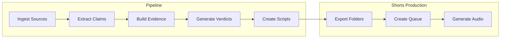
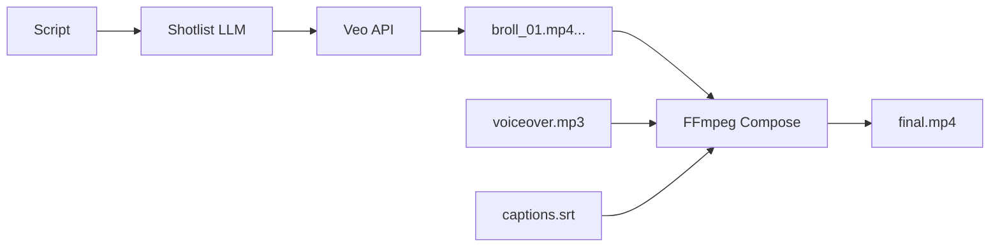
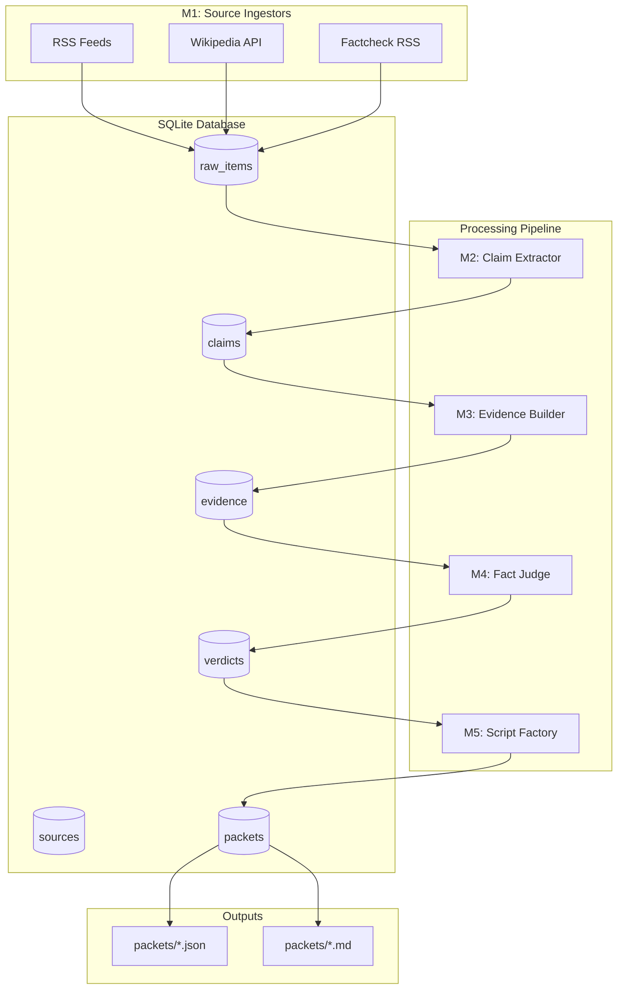

# Myth Museum

**Automated Fact-Checking Content Pipeline**

Myth Museum is a Python-based content pipeline that automatically generates "Topic Packets" - structured fact-check outputs suitable for video scripts, articles, and social media content. It ingests content from various sources (RSS feeds, Wikipedia, fact-checking sites), extracts claims, gathers evidence, generates verdicts, and produces ready-to-use content packets.

## Features

- 🔍 **Multi-Source Ingestion**: RSS feeds, Wikipedia API, and fact-checking sites
- 🧠 **Claim Extraction**: Regex-based baseline with optional LLM enhancement
- 📚 **Evidence Gathering**: Wikipedia, Crossref (academic), and fact-check databases
- ⚖️ **Verdict Generation**: Rule-based heuristics with optional LLM-powered analysis
- 📝 **Script Generation**: Shorts scripts (30-60s) and long-form outlines (6-10 min)
- 🗄️ **SQLite Storage**: All data persisted locally for offline operation
- 🔄 **Re-runnable**: Pipeline can be run repeatedly without duplicating data
- 🤖 **MetaGPT Integration**: Optional multi-agent orchestration
- 🌐 **REST API**: FastAPI endpoints for viewing and managing packets

### NEW: Automated Video Generation

- 🎬 **One-Click Video Generation**: Generate complete YouTube Shorts from a topic
- 🎨 **Multiple Visual Styles**: Oil painting cartoon, photorealistic, Pixar 3D, watercolor, cinematic, sci-fi, watercolor fantasy
- 📖 **Narrative Arc Templates**: Myth Buster, Historical Figure, Lost Civilization
- 👤 **Character Consistency**: 20+ pre-defined historical figures with consistent visual descriptions
- 🖼️ **Multi-Provider Image Generation**: Imagen 3, DALL-E 3, Pexels, Picsum with automatic fallback
- 🔊 **TTS Integration**: Google TTS for automatic voiceover generation with word-level timing
- 📝 **Rich Subtitles**: ASS format with punch animations and **keyword color highlighting**
- 🎞️ **Ken Burns Effect**: Smooth zoom/pan animations between images
- ✅ **Quality Gates**: Pre-flight checks and phase gates ensure consistent video quality
- 🔒 **Fool-Proofing**: Subtitle completeness validation prevents truncated text

---

## Video Generation Quick Start

Generate a complete myth-busting YouTube Short in one command:

```powershell
# High quality video with Imagen 3
python -m pipeline.generate_short generate "Da Vinci Mona Lisa myth" --quality high

# Standard quality (faster)
python -m pipeline.generate_short generate "Napoleon height myth" --quality standard

# With custom script file
python -m pipeline.generate_short generate "Beethoven deafness" -f my_script.txt --quality high
```

### Interactive Jupyter Notebook

For experimentation and fine-tuning, use the interactive notebook:

```powershell
jupyter notebook notebooks/myth_generator.ipynb
```

The notebook allows you to:
1. Enter a topic and auto-generate scripts
2. Select visual style and narrative arc
3. Preview and edit image prompts
4. Generate and preview images
5. Regenerate individual images
6. One-click final video generation

---

## Pre-Flight Checks & Quality Gates

Before generating any video, the system automatically validates all dependencies:

```powershell
# Run pre-flight checks manually
python -m pipeline.generate_short preflight
```

### Pre-Flight Checks (Phase 0)

| Check | Type | Description |
|-------|------|-------------|
| FFmpeg | **Required** | Video rendering engine |
| Google Cloud | **Required** | TTS and Imagen API |
| Output Dir | **Required** | Writable permissions |
| OpenAI API | Warning | DALL-E fallback |
| Pexels API | Warning | Stock photo fallback |

### Phase Gates

Each generation phase has a quality gate that must pass:

| Phase | Gate | Failure Action |
|-------|------|----------------|
| 0 | Pre-flight checks | Abort with setup instructions |
| 3 | >= 4 images generated | Abort |
| 4 | Audio 10-120 seconds | Abort |
| 4.5 | Subtitle coverage >= 95% | Abort |
| 5 | ASS file created | Abort |
| 7 | Video streams valid | Abort |

### Subtitle Validation

The system prevents subtitle truncation by validating word coverage:

```
Script words: 107
Subtitle words: 105
Coverage: 98.1% >= 95%  ✓ GATE PASSED
```

If subtitles are truncated, the generation stops with a clear error message.

---

## Keyword Color Highlighting

Important words are automatically highlighted in **orange** for emphasis:

| Category | Examples |
|----------|----------|
| Negation | not, never, no, don't, won't, can't |
| Contrast | but, however, actually, wrong, false, true |
| Superlatives | most, least, best, worst, only, first, last |
| Numbers | million, billion, thousand, hundred |
| Time | years, centuries, forever, still |

The highlighting uses ASS override tags for smooth color transitions.

---

## Image Quality Settings

| Quality | Model | Speed | Best For |
|---------|-------|-------|----------|
| `high` | Imagen 3 | Slow (1/min quota) | Final production |
| `standard` | Imagen @006 | Fast | Testing & iteration |
| `fallback` | Pexels/Picsum | Instant | Quick prototypes |

```powershell
# Set quality via command line
python -m pipeline.generate_short generate "Topic" --quality high

# Or via environment variable
$env:IMAGE_QUALITY = "high"
```

### API Configuration

```powershell
# Vertex AI (Imagen) - Primary
$env:GOOGLE_APPLICATION_CREDENTIALS = "path/to/service-account.json"

# OpenAI (DALL-E 3) - Fallback
$env:OPENAI_API_KEY = "sk-..."

# Pexels (Stock Photos) - Fallback (free: https://www.pexels.com/api/)
$env:PEXELS_API_KEY = "..."
```

---

## Storyboard Templates

### Narrative Arcs

Each arc provides a 6-scene story structure:

| Arc | Best For | Scenes |
|-----|----------|--------|
| `myth_buster` | Debunking common beliefs | Mystery Intro → Famous Artifact → Research → Evidence → Revelation → Victory |
| `historical_figure` | Biographical content | Portrait → Early Life → Defining Moment → At Work → Legacy → Remembered |
| `lost_civilization` | Ancient history | Ruins Discovery → Peak Glory → Daily Life → Sacred Ritual → Decline → Modern Mystery |

```powershell
# List available arcs
python -m pipeline.generate_short list-arcs
```

### Visual Styles

| Style ID | Description |
|----------|-------------|
| `oil_painting_cartoon` | Renaissance oil painting cartoon (warm, scholarly) |
| `realistic` | Photorealistic documentary style |
| `flat_illustration` | Clean educational cartoon |
| `pixar_3d` | Pixar-style 3D cartoon |
| `watercolor` | Soft dreamy watercolor |
| `cinematic` | Hollywood movie quality |
| `vintage_sepia` | Aged sepia-toned photography (historical) |
| `sci_fi_cinematic` | Interstellar/Star Trek aesthetic (space themes) |
| `watercolor_fantasy` | Dreamy watercolor for mythology (Greek myths) |

```powershell
# List available styles
python -m pipeline.generate_short list-styles
```

---

## Character Library

Pre-defined character descriptions for consistent visuals across scenes:

| Character | Key Features |
|-----------|--------------|
| `da_vinci` | Aged Renaissance master, long white beard, burgundy robes |
| `beethoven` | Wild hair, intense expression, high-collar period clothing |
| `mozart` | Powdered wig, elegant 18th century court dress |
| `napoleon` | Bicorne hat, French military uniform, commanding presence |
| `einstein` | Wild white hair, friendly expression, casual sweater |
| `cleopatra` | Egyptian royal garments, elaborate gold jewelry |
| `edison` | Middle-aged inventor, three-piece suit, laboratory setting |
| `odysseus` | Greek warrior-king, dark curly hair, weathered by sea voyages |
| `calypso` | Immortal nymph goddess, flowing hair with sea flowers |
| `zeus` | King of gods, silver beard, thunderbolt, throne among clouds |
| `sphinx` | Great Sphinx of Giza, lion body with human head, weathered limestone |

Characters are auto-detected from topics. For "Da Vinci Mona Lisa", the system automatically uses the `da_vinci` character description for all 6 images.

---

## CLI Commands Reference

### Video Generation Commands

| Command | Description |
|---------|-------------|
| `generate` | Generate complete short video from topic |
| `preflight` | Run pre-flight checks (verify dependencies) |
| `preview` | Preview generated images in a folder |
| `regenerate` | Regenerate a single image |
| `render` | Re-render video from existing images |
| `list-styles` | List available visual styles |
| `list-arcs` | List available narrative arcs |
| `list-series` | List series and episode counts |

### Examples

```powershell
# Generate new video
python -m pipeline.generate_short generate "Einstein relativity" --quality high

# Preview images
python -m pipeline.generate_short preview outputs/shorts/science-myths_einstein

# Regenerate image #3 with custom prompt
python -m pipeline.generate_short regenerate outputs/shorts/science-myths_einstein 3 -p "New prompt here"

# Re-render video after regenerating images
python -m pipeline.generate_short render outputs/shorts/science-myths_einstein
```

---

## Quick Start

### 1. Installation

```powershell
cd C:\Users\alhung\MetaGPT\projects\myth-museum
pip install -e .

# For API support
pip install -e ".[api]"

# For development
pip install -e ".[dev]"
```

### 2. Initialize Database

```powershell
python -m pipeline.run_daily init-db
```

### 3. Configure Sources

Edit `config/sources.yaml` to add your RSS feeds and Wikipedia topics:

```yaml
llm:
  base_url: "https://api.openai.com/v1"
  api_key: "your-api-key-here"  # Or set MYTH_LLM_API_KEY env var
  model: "gpt-4-turbo"

sources:
  - name: "BBC News"
    type: "rss"
    config_json:
      feed_url: "https://feeds.bbci.co.uk/news/rss.xml"
    enabled: true

  - name: "PolitiFact"
    type: "factcheck"
    config_json:
      feed_url: "https://www.politifact.com/rss/all/"
    enabled: true

wiki_topics:
  - "health myths"
  - "common misconceptions"
```

### 4. Sync Sources to Database

```powershell
python -m pipeline.run_daily sync-sources
```

### 5. Run the Pipeline

```powershell
# Full pipeline run (local orchestrator)
python -m pipeline.run_daily run-daily --limit 5 --min-score 50 --orchestrator local

# Full pipeline run (MetaGPT orchestrator - requires valid LLM API key)
python -m pipeline.run_daily run-daily --limit 5 --min-score 50 --orchestrator metagpt

# Or run individual steps:
python -m pipeline.run_daily ingest --source-type all
python -m pipeline.run_daily extract --limit 10
python -m pipeline.run_daily evidence --limit 5
python -m pipeline.run_daily judge --limit 5
python -m pipeline.run_daily scripts --limit 5
```

### 6. View Results

Check the `outputs/packets/` directory for generated content:
- `{claim_id}.json` - Structured JSON packet
- `{claim_id}.md` - Markdown summary

## CLI Commands

| Command | Description |
|---------|-------------|
| `init-db` | Initialize SQLite database |
| `status` | Show database statistics |
| `sync-sources` | Sync sources.yaml to database |
| `ingest` | Fetch content from sources |
| `extract` | Extract claims from raw content |
| `evidence` | Gather evidence for claims |
| `judge` | Generate verdicts for claims |
| `scripts` | Generate video scripts and packets |
| `run-daily` | Run full pipeline |
| `export` | Export packets to files |

### Common Options

| Option | Description |
|--------|-------------|
| `--limit N` | Maximum items to process |
| `--min-score N` | Minimum claim score (0-100) |
| `--topic TOPIC` | Filter by topic |
| `--use-llm-extract` | Use LLM for claim extraction |
| `--use-llm-judge` | Use LLM for verdict generation |
| `--use-llm-script` | Use LLM for script generation |
| `--orchestrator MODE` | Use `local` or `metagpt` mode |
| `--skip-ingest` | Skip the ingestion step |
| `--export-shorts` | Export shorts production folders |
| `--make-queue` | Create prioritized shorts queue |
| `--prepare-queue` | Auto-complete missing steps in queue |
| `--render-shorts` | Render ready shorts to final.mp4 |

## Shorts Production Export

Convert packets into production-ready folders for YouTube Shorts. Each folder contains all files needed for video editors (CapCut/剪映) to produce a short-form video.

### Quick Start

```powershell
# Export existing packets to shorts folders
python -m pipeline.export_shorts_pack export --from-files --limit 5

# Or include in daily pipeline
python -m pipeline.run_daily run-daily --limit 5 --min-score 60 --export-shorts

# Filter by topic
python -m pipeline.export_shorts_pack export --from-db --topic health --limit 3
```

### Output Structure

Each packet generates a folder at `outputs/shorts/{claim_id}/`:

```
outputs/shorts/42/
├── voiceover.txt      # Narration script for voice recording
├── shotlist.csv       # Scene-by-scene breakdown for editor
├── captions.srt       # Subtitle file (rough timestamps)
├── metadata.json      # Title, description, hashtags for upload
├── sources.md         # Source citations for description
└── assets_needed.md   # Visual asset checklist
```

### File Descriptions

| File | Purpose | Used By |
|------|---------|---------|
| **voiceover.txt** | Complete narration script with hook, content, CTA, and disclaimer | Voice actor / TTS |
| **shotlist.csv** | Scene breakdown with timings, visuals, on-screen text, SFX | Video editor |
| **captions.srt** | SRT-format subtitles ready for import | CapCut / YouTube |
| **metadata.json** | Title, alternatives, hashtags, topic info | Publisher |
| **sources.md** | Full source citations with URLs | Description editor |
| **assets_needed.md** | Categorized visual requirements | Asset finder |

### Voiceover Format

The voiceover script includes:
1. **Hook** - Attention-grabbing opening (counter-intuitive or provocative)
2. **Content** - Key facts from the verdict
3. **CTA** - "Comment below: What other myths have you heard?"
4. **Disclaimer** - Auto-added for health/law topics

Example:
```
Did you know this common belief is completely wrong?

Based on multiple scientific studies, this claim is false.
Here's what the evidence actually shows...

Follow for more fact-checks! Link in bio for sources.

Comment below: What other myths have you heard?

(Not medical advice - consult a healthcare professional.)
```

### Shotlist CSV Format

| Column | Description |
|--------|-------------|
| time_start | Start time in seconds |
| time_end | End time in seconds |
| scene | Scene number |
| voice_line | Narration for this segment |
| on_screen_text | Short text overlay (max 12 chars / 6 words) |
| visual_suggestion | B-roll / animation / graphic suggestion |
| sfx | Sound effect (whoosh, reveal_ding, etc.) |

### Hashtags

Automatically generated based on topic (8-12 per video):

| Topic | Example Hashtags |
|-------|------------------|
| health | #health #factcheck #wellness #science #mythbusted |
| science | #science #factcheck #physics #education #debunked |
| history | #history #factcheck #historical #learning #facts |

**Safety**: Hashtags avoid medical claims, exaggerated promises, and policy violations.

### Disclaimers

Health and law topics automatically include a short disclaimer:

- **English**: "(Not medical advice - consult a healthcare professional.)"
- **Chinese**: "（非醫療建議，請諮詢專業醫師）"

### CLI Options

```powershell
python -m pipeline.export_shorts_pack export --help
```

| Option | Description |
|--------|-------------|
| `--limit N` | Maximum packets to export |
| `--topic TOPIC` | Filter by topic |
| `--out-dir PATH` | Output directory (default: outputs/shorts) |
| `--from-db` | Load packets from database |
| `--from-files` | Load packets from JSON files |
| `--overwrite` | Overwrite existing folders |
| `--min-confidence N` | Minimum confidence threshold (0.0-1.0) |

### Integration with Daily Pipeline

Add `--export-shorts` to automatically export after generating scripts:

```powershell
python -m pipeline.run_daily run-daily \
    --limit 10 \
    --min-score 60 \
    --export-shorts
```

The summary will show:
```
═══ Pipeline Summary ═══
┌──────────────────┬───────┐
│ Metric           │ Count │
├──────────────────┼───────┤
│ New raw items    │    15 │
│ Claims extracted │    10 │
│ Evidence gathered│     8 │
│ Verdicts generated│    8 │
│ Packets created  │     8 │
│ Shorts exported  │     8 │
└──────────────────┴───────┘

Shorts Output:
  • Location: outputs/shorts/
  • Folders: 8
```

### View Exported Shorts

```powershell
# Show contents of a shorts folder
python -m pipeline.export_shorts_pack show 42
```

### Notes for Editors

1. **voiceover.txt** can be used directly for TTS or voice recording
2. **shotlist.csv** maps 1:1 with timeline segments in CapCut
3. **captions.srt** can be imported directly into most video editors
4. **metadata.json** has copy-paste ready title and hashtags
5. **sources.md** content goes in video description for transparency
6. **assets_needed.md** helps plan B-roll and graphics needs

## Daily Shorts Workflow

Complete workflow from raw content to upload-ready Shorts with auto-generated audio.

### Overview



### 1. Generate Shorts Folders with Queue

Run the full pipeline with shorts export and queue creation:

```powershell
python -m pipeline.run_daily run-daily --limit 10 --export-shorts --make-queue
```

This will:
1. Ingest from sources
2. Extract and process claims
3. Generate packets
4. Export shorts folders to `outputs/shorts/`
5. Create a prioritized queue at `outputs/shorts_queue/queue_{date}.csv`

### 2. Generate Voice-over Audio with TTS

After exporting shorts folders, generate MP3 audio files:

```powershell
# Install edge-tts (first time only)
pip install edge-tts

# Generate audio for all shorts folders
python -m pipeline.tts batch --in-dir outputs/shorts --limit 10

# Or for a specific claim
python -m pipeline.tts single 42

# With custom voice settings
python -m pipeline.tts batch --voice en-US-JennyNeural --rate "+10%"
```

The TTS module will:
- Read `voiceover.txt` from each folder
- Auto-detect language (English or Chinese)
- Generate `voiceover.mp3` using edge-tts
- Adjust `captions.srt` timing to match audio duration

### 3. Review Queue and Start Editing

Open the queue file to see today's prioritized lineup:

```powershell
# View queue in terminal
python -m pipeline.select_for_shorts show --date 2026-01-03
```

Queue CSV columns:
| Column | Description |
|--------|-------------|
| rank | Priority position |
| claim_id | Database claim ID |
| topic | Topic category |
| verdict | Fact-check verdict |
| confidence | Confidence score |
| title | Suggested video title |
| hook | Opening line hook |
| estimated_seconds | Estimated video duration |
| folder_path | Path to shorts folder |
| status | "ready" or "needs_export" |

### Shorts Queue Selection

Create a queue from existing packets:

```powershell
# Basic queue (top 10 by score)
python -m pipeline.select_for_shorts select --limit 10

# With topic diversity
python -m pipeline.select_for_shorts select --limit 10 --topic-mix

# Filter by confidence
python -m pipeline.select_for_shorts select --limit 10 --min-confidence 0.7

# From files instead of database
python -m pipeline.select_for_shorts select --from-files --limit 10
```

#### Selection Rules

The queue is prioritized by:

1. **Verdict Weight**: False (10) > Misleading (8) > Depends (5) > True (3) > Unverified (0)
2. **Confidence Score**: Higher confidence = higher priority
3. **Evidence Diversity**: More source types = bonus points
4. **Safety Gates**: Health/Law topics require higher confidence (0.7+) and 2+ evidence types
5. **Deduplication**: Similar claims (>85% similarity) are merged

With `--topic-mix`, the queue ensures at least one item from each major topic category.

### TTS Voice Options

List available voices:

```powershell
python -m pipeline.tts list-voices --language en
python -m pipeline.tts list-voices --language zh
```

Default voices:
| Language | Voice |
|----------|-------|
| English | en-US-GuyNeural |
| Chinese | zh-CN-YunxiNeural |

Override defaults:
```powershell
python -m pipeline.tts batch --voice en-US-AriaNeural --rate "+5%" --pitch "-2Hz"
```

### TTS Provider Selection

Choose between multiple TTS providers:

```powershell
# Edge TTS (default, free, no API key)
python -m pipeline.tts single 42 --provider edge

# Google Cloud TTS (high quality, accurate timing)
python -m pipeline.tts single 42 --provider google

# OpenAI-compatible HTTP API
python -m pipeline.tts single 42 --provider http
```

| Provider | Pros | Cons | Setup |
|----------|------|------|-------|
| `edge` | Free, no API key | SSL issues on some networks | `pip install edge-tts` |
| `google` | High quality, **precise subtitle timing** | Requires GCP account | Service account JSON |
| `http` | Flexible, OpenAI-compatible | Requires API key | Environment variables |

### Google Cloud TTS with Precise Subtitle Sync

Google Cloud TTS provides **sentence-level timepoints**, enabling perfectly synchronized subtitles:

```powershell
# Setup: Place service account JSON in project root
# Or set environment variable:
$env:GOOGLE_APPLICATION_CREDENTIALS = "path/to/service-account.json"

# Generate audio with synced subtitles
python -m pipeline.tts single 42 --provider google
```

**How it works:**

1. Text is converted to SSML with `<mark>` tags for each sentence
2. Google TTS returns audio **plus** exact timing for each mark
3. `captions.srt` is regenerated with precise timestamps from Google

**Result:** Subtitles appear exactly when the corresponding sentence is spoken, not estimated from word counts.

Example timing from Google TTS:
```
1
00:00:00,000 --> 00:00:03,512
There's something wrong with this common belief.

2
00:00:03,512 --> 00:00:04,687
Let me explain.

3
00:00:04,687 --> 00:00:08,075
Based on 10 sources, this claim is misleading.
```

### HTTP TTS Provider (OpenAI-compatible)

For OpenAI or compatible TTS APIs:

```powershell
$env:OPENAI_API_KEY = "your-api-key"
$env:OPENAI_BASE_URL = "https://api.openai.com/v1"  # Optional
$env:OPENAI_MODEL_TTS = "tts-1"                      # Optional
$env:OPENAI_TTS_VOICE = "alloy"                      # Optional

python -m pipeline.tts single 42 --provider http
```

### SRT Caption Adjustment

If audio duration differs significantly (>15%) from caption timestamps, the TTS module automatically scales the SRT file:

```powershell
# Manual adjustment
python -m pipeline.tts adjust-srt outputs/shorts/42/captions.srt 35.5
```

This ensures captions roughly sync with the generated audio.

### Complete Daily Command

For daily production, run:

```powershell
# Full pipeline: ingest -> process -> export -> queue
python -m pipeline.run_daily run-daily \
    --limit 10 \
    --min-score 60 \
    --export-shorts \
    --make-queue

# Then generate audio
python -m pipeline.tts batch --in-dir outputs/shorts --limit 10
```

## Fully Automated Shorts Workflow

One command to go from raw content to rendered videos ready for upload.

### Quick Start

```powershell
# Full automation: ingest -> process -> export -> queue -> prepare -> render
python -m pipeline.run_daily run-daily \
    --limit 5 \
    --min-score 60 \
    --export-shorts \
    --make-queue \
    --prepare-queue \
    --render-shorts
```

This single command will:
1. **Ingest** content from configured sources
2. **Process** claims through evidence gathering and verdict generation
3. **Export** shorts folders with all production files
4. **Create queue** with prioritized selections
5. **Prepare** queue items (export missing folders, generate TTS audio)
6. **Render** videos to `final.mp4` using ffmpeg

### Prerequisites

```powershell
# Install TTS support
pip install edge-tts

# Install ffmpeg (Windows)
winget install ffmpeg
# Or: choco install ffmpeg
# Or: Download from https://www.ffmpeg.org/download.html and add to PATH
```

### Status State Machine

Each shorts folder progresses through these states:

| Status | Description | Required Files |
|--------|-------------|----------------|
| `needs_export` | Folder missing or incomplete | - |
| `needs_tts` | Has 6 base files, needs audio | voiceover.txt, shotlist.csv, captions.srt, metadata.json, sources.md, assets_needed.md |
| `ready` | Has all files, ready to render | + voiceover.mp3 |
| `rendered` | Video complete | + final.mp4 |

### Pipeline Stages

#### Stage 1: Export Shorts Folders

```powershell
python -m pipeline.export_shorts_pack export --from-db --limit 10
```

Creates `outputs/shorts/{claim_id}/` with 6 production files.

#### Stage 2: Create Queue

```powershell
python -m pipeline.select_for_shorts select --limit 10 --topic-mix
```

Creates `outputs/shorts_queue/queue_{date}.csv` with prioritized selections.

#### Stage 3: Prepare Queue Items

```powershell
python -m pipeline.prepare_shorts prepare --date 2026-01-03 --limit 10
```

Auto-completes missing steps:
- Exports folders for items with `needs_export` status
- Generates TTS audio for items with `needs_tts` status
- Validates and repairs SRT timestamps
- Updates queue CSV with new statuses
- Generates prepare report at `queue_dir/prepare_report_{date}.md`

#### Stage 4: Render Videos

```powershell
python -m pipeline.render_basic_short render --date 2026-01-03 --limit 5
```

Renders `ready` items to `final.mp4`:
- 1080x1920 vertical format (YouTube Shorts)
- 30fps, H.264 video + AAC audio
- Burned-in subtitles from captions.srt
- Black background (or custom with `--background assets/bg.png`)

### Video Specifications

| Property | Value |
|----------|-------|
| Resolution | 1080x1920 (9:16) |
| Frame Rate | 30 fps |
| Video Codec | H.264 (libx264) |
| Audio Codec | AAC 192kbps |
| Subtitles | Burned-in (hardcoded) |

### CLI Commands

#### prepare-shorts

```powershell
python -m pipeline.prepare_shorts prepare --help
```

| Option | Description |
|--------|-------------|
| `--date DATE` | Queue date (default: today) |
| `--limit N` | Max items to process |
| `--queue-dir PATH` | Queue directory |
| `--shorts-dir PATH` | Shorts output directory |

#### render-basic-short

```powershell
python -m pipeline.render_basic_short render --help
```

| Option | Description |
|--------|-------------|
| `--date DATE` | Queue date (default: today) |
| `--limit N` | Max items to render |
| `--background PATH` | Custom background image |
| `--queue-dir PATH` | Queue directory |
| `--shorts-dir PATH` | Shorts output directory |

### Final Output Structure

After full workflow, each shorts folder contains:

```
outputs/shorts/42/
├── voiceover.txt      # Narration script
├── voiceover.mp3      # Generated audio (TTS)
├── shotlist.csv       # Scene breakdown
├── captions.srt       # Synced subtitles
├── metadata.json      # Upload metadata
├── sources.md         # Source citations
├── assets_needed.md   # Visual requirements
└── final.mp4          # Rendered video (1080x1920)
```

### Pipeline Summary Example

```
=== Pipeline Summary ===
+--------------------+-------+
| Metric             | Count |
+--------------------+-------+
| New raw items      |    15 |
| Claims extracted   |    10 |
| Evidence gathered  |     8 |
| Verdicts generated |     8 |
| Packets created    |     8 |
| Shorts exported    |     8 |
| Queue items        |     8 |
| Items prepared     |     8 |
| Videos rendered    |     5 |
+--------------------+-------+

Rendered Videos:
  - Location: outputs/shorts/*/final.mp4
  - Count: 5

OK Pipeline complete!
```

### Troubleshooting

#### ffmpeg not found

```
Error: ffmpeg not found. Please install ffmpeg and add it to PATH.

Windows installation:
  1. Download from https://www.ffmpeg.org/download.html
  2. Extract to C:\ffmpeg
  3. Add C:\ffmpeg\bin to system PATH
  4. Restart terminal/IDE

Or use: winget install ffmpeg
```

#### TTS generation fails

```powershell
# Install edge-tts
pip install edge-tts

# Test voice generation
python -m pipeline.tts single 42

# If edge-tts has SSL issues, try Google TTS:
$env:GOOGLE_APPLICATION_CREDENTIALS = "path/to/service-account.json"
python -m pipeline.tts single 42 --provider google
```

#### Subtitle timing mismatch

If subtitles don't sync with audio, use Google TTS provider which returns precise timing:

```powershell
# Google TTS generates synced captions.srt automatically
python -m pipeline.tts single 42 --provider google

# Then re-render
python -m pipeline.render_basic_short single 42
```

#### SRT timing issues

The prepare stage automatically validates and repairs SRT files:
- Ensures start < end for each segment
- Ensures timestamps are monotonically increasing
- Scales timestamps to match audio duration (if >15% difference)

Pipeline summary will show:
```
=== Pipeline Summary ===
+--------------------+-------+
| Metric             | Count |
+--------------------+-------+
| New raw items      |    15 |
| Claims extracted   |    10 |
| Evidence gathered  |     8 |
| Verdicts generated |     8 |
| Packets created    |     8 |
| Shorts exported    |     8 |
| Queue items        |     8 |
+--------------------+-------+

Shorts Queue:
  - CSV: outputs/shorts_queue/queue_2026-01-03.csv
  - Items: 8
  - Topic mix:
      health: 3
      science: 2
      history: 2
      unknown: 1
```

### Output After Full Workflow

```
outputs/
├── packets/           # Structured JSON/MD packets
│   ├── 42.json
│   └── 42.md
├── shorts/           # Production folders
│   └── 42/
│       ├── voiceover.txt     # Script
│       ├── voiceover.mp3     # Generated audio (from TTS)
│       ├── shotlist.csv      # Scene breakdown
│       ├── captions.srt      # Adjusted subtitles
│       ├── metadata.json     # Upload metadata
│       ├── sources.md        # Citations
│       └── assets_needed.md  # Visual requirements
└── shorts_queue/     # Daily queues
    ├── queue_2026-01-03.csv
    └── queue_2026-01-03.md
```

### Example Queue CSV

```csv
rank,claim_id,topic,verdict,confidence,title,hook,estimated_seconds,folder_path,status
1,42,health,False,0.95,Myth Busted: Bleach Cures,Think bleach can cure you? Think again!,40,outputs/shorts/42,ready
2,15,science,False,0.88,Water Memory Debunked,Does water remember?,38,outputs/shorts/15,ready
3,28,history,Misleading,0.82,Napoleon's Height,Was Napoleon really short?,42,outputs/shorts/28,ready
```

## Veo Video Generation (AI B-roll)

Generate short videos using AI-generated video clips instead of static images.

### Overview

The Veo pipeline creates B-roll video clips using Google Veo, then composes them into a final video with voiceover and subtitles.



### Setup

1. **Get a Gemini API Key** (free tier available):
   - Go to [Google AI Studio](https://aistudio.google.com/)
   - Create an API key
   - Set environment variable:
   
   ```powershell
   $env:GEMINI_API_KEY = "AIza..."
   ```

2. **Install FFmpeg**:
   ```powershell
   winget install ffmpeg
   # Or: choco install ffmpeg
   ```

### Quick Start

```powershell
# Generate video short with Veo B-roll
python -m pipeline.generate_video_short "Napoleon height myth"

# With specific series
python -m pipeline.generate_video_short "Aztec civilization" --series "Lost Civs"

# With custom script
python -m pipeline.generate_video_short "El Dorado legend" -f my_script.txt
```

### Output Structure

Video shorts are saved with `_video` suffix:

```
outputs/shorts/
  lost-civs_el-dorado_video/      # Veo video-based
    broll/
      broll_01.mp4
      broll_02.mp4
      broll_03.mp4
      broll_04.mp4
    shotlist.csv
    voiceover.mp3
    captions.srt
    captions.ass
    background.mp4
    final.mp4
    
  lost-civs_el-dorado_image/      # Image-based (original)
    backgrounds/
      bg_1.jpg...
    final.mp4
```

### Pipeline Stages

1. **Shotlist Generation**: LLM creates visual descriptions for each segment
2. **B-roll Generation**: Veo creates 5-8 second video clips
3. **TTS Generation**: Google TTS creates voiceover audio
4. **Composition**: FFmpeg combines clips, audio, and subtitles

### CLI Commands

```powershell
# Full video generation
python -m pipeline.generate_video_short "topic" [options]

# Just generate shotlist
python -m pipeline.generate_video_short shotlist "topic" -f script.txt

# Check provider status
python -m pipeline.generate_video_short status

# Generate B-roll from existing shotlist
python -m pipeline.veo generate outputs/shorts/my-folder

# Compose video from existing assets
python -m pipeline.compose_short compose outputs/shorts/my-folder
```

### Environment Variables

| Variable | Description | Required |
|----------|-------------|----------|
| `GEMINI_API_KEY` | Google AI Studio API key | Yes (for Gemini provider) |
| `VEO_PROVIDER` | Provider: `gemini` or `vertex` | No (default: gemini) |
| `VEO_MODEL` | Model override | No (auto-detect) |
| `VERTEX_PROJECT_ID` | GCP project ID | Only for Vertex |
| `GOOGLE_APPLICATION_CREDENTIALS` | Service account JSON | Only for Vertex |

### Integration with Daily Pipeline

```powershell
# Full pipeline with Veo video generation
python -m pipeline.run_daily run-daily \
    --limit 5 \
    --export-shorts \
    --generate-broll \
    --compose-video \
    --veo-provider gemini
```

### Video Specifications

| Property | Value |
|----------|-------|
| Resolution | 1080x1920 (9:16 vertical) |
| Frame Rate | 30 fps |
| Video Codec | H.264 (libx264) |
| Audio Codec | AAC 192kbps |
| Audio Normalization | loudnorm (I=-16) |
| Subtitles | Burned-in (ASS) |
| B-roll Duration | 5-8 seconds per clip |

### Shotlist CSV Format

Generated by LLM for each video:

| Column | Description |
|--------|-------------|
| shot_id | Sequence number |
| segment | hook, context, contrast, resolution |
| start_time | Start time in seconds |
| end_time | End time in seconds |
| visual_description | Detailed visual for Veo |
| notes | Additional notes |

### Veo Provider Options

| Provider | Pros | Cons |
|----------|------|------|
| **Gemini** (default) | Free tier, API key only | May have rate limits |
| **Vertex** | Enterprise, more control | Requires GCP project + service account |

### Troubleshooting

#### No Veo providers available

```powershell
# Check status
python -m pipeline.generate_video_short status

# Set Gemini API key
$env:GEMINI_API_KEY = "AIza..."
```

#### FFmpeg not found

```powershell
# Install FFmpeg
winget install ffmpeg

# Verify installation
ffmpeg -version
```

#### B-roll generation failed

If Veo generation fails, the compose step will use a fallback solid color background. You can:

1. Check API key is valid
2. Retry with different prompts
3. Use image-based pipeline instead: `python -m pipeline.generate_short`

## LLM Configuration

### Environment Variables

```powershell
$env:MYTH_LLM_API_KEY = "your-api-key"
$env:MYTH_LLM_BASE_URL = "https://api.openai.com/v1"
$env:MYTH_LLM_MODEL = "gpt-4-turbo"
```

### OpenAI-Compatible APIs

The LLM client supports any OpenAI-compatible API. Just set the `base_url`:

```yaml
llm:
  base_url: "https://api.anthropic.com/v1"  # or any compatible endpoint
  api_key: "your-api-key"
  model: "claude-3-sonnet-20240229"
```

## REST API

Start the FastAPI server:

```powershell
cd C:\Users\alhung\MetaGPT\projects\myth-museum
uvicorn app.main:app --reload
```

Then visit:
- Swagger UI: http://127.0.0.1:8000/docs
- ReDoc: http://127.0.0.1:8000/redoc

### API Endpoints

| Endpoint | Method | Description |
|----------|--------|-------------|
| `/` | GET | API info |
| `/health` | GET | Health check |
| `/status` | GET | Database statistics |
| `/packets` | GET | List all packets |
| `/packets/{id}` | GET | Get specific packet |
| `/claims` | GET | List claims |
| `/claims/{id}/evidence` | GET | Get claim evidence |
| `/claims/{id}/verdict` | GET | Get claim verdict |
| `/run` | POST | Trigger pipeline run |

## MetaGPT Integration

Myth Museum can use MetaGPT for multi-agent orchestration of the fact-checking pipeline.

### Roles

| Role | Description |
|------|-------------|
| **Researcher** | Gathers evidence from multiple sources |
| **FactChecker** | Analyzes evidence and generates verdicts |
| **ScriptWriter** | Creates video scripts and content |
| **QAReviewer** | Validates citations, format, and disclaimers |

### Usage

```powershell
# Run with MetaGPT orchestration (requires LLM API key)
python -m pipeline.run_daily run-daily --orchestrator metagpt --limit 3

# Falls back to local if MetaGPT fails
```

### Requirements

- Valid LLM API key configured
- MetaGPT must be in the Python path (works when run from MetaGPT repo)

## Output Format

### Packet JSON Structure

```json
{
  "claim": "Drinking 8 glasses of water daily is necessary for health",
  "claim_id": 42,
  "topic": "health",
  "language": "en",
  "verdict": "Misleading",
  "confidence": 0.75,
  "one_line_verdict": "This claim oversimplifies hydration needs",
  "why_believed": [
    "Repeated in health advice for decades",
    "Simple rule that's easy to remember"
  ],
  "what_wrong": "Water needs vary by individual, climate, and activity level",
  "why_reasonable": "The '8 glasses' rule provides a simple guideline",
  "truth": "Hydration needs are individual; thirst is generally a good guide",
  "citation_map": {
    "one_line_verdict": [1, 2],
    "truth": [3, 4]
  },
  "disclaimer": "⚠️ This content is for educational purposes only...",
  "shorts_script": {
    "hook": "You've been told to drink 8 glasses of water... But is it true?",
    "segments": [...],
    "cta": "Follow for more fact-checks!",
    "total_duration": 35
  },
  "long_outline": {
    "chapters": [...],
    "total_duration_minutes": 8.0
  },
  "titles": [...],
  "description": "...",
  "visuals": [...],
  "next_myths": [...],
  "sources": [...],
  "created_at": "2024-01-01T12:00:00"
}
```

### Verdict Types

| Verdict | Meaning |
|---------|---------|
| `True` | Claim is accurate |
| `False` | Claim is inaccurate |
| `Misleading` | Partially true but context-dependent |
| `Depends` | Accuracy depends on specific conditions |
| `Unverified` | Insufficient evidence to determine |

## Project Structure

```
myth-museum/
├── app/                    # FastAPI endpoints
│   └── main.py             # REST API
├── config/
│   └── sources.yaml        # Source configuration
├── core/
│   ├── config.py           # Configuration loading
│   ├── constants.py        # Enums and constants
│   ├── db.py               # SQLite operations
│   ├── llm.py              # LLM client
│   ├── logging.py          # Rich logger
│   ├── models.py           # Pydantic models
│   └── textnorm.py         # Text normalization
├── data/
│   └── myth_museum.sqlite  # SQLite database
├── ingest/
│   ├── factcheck.py        # Fact-check RSS
│   ├── rss.py              # RSS feed ingestion
│   └── wiki.py             # Wikipedia API
├── metagpt_integration/
│   ├── actions.py          # MetaGPT Actions
│   ├── orchestrator.py     # Team orchestration
│   ├── roles.py            # MetaGPT Roles
│   └── schemas.py          # Message schemas
├── outputs/
│   ├── packets/            # Generated content (JSON/MD)
│   ├── shorts/             # Shorts production folders
│   └── shorts_queue/       # Daily queue CSV/MD files
├── pipeline/
│   ├── build_evidence.py   # Evidence gathering
│   ├── export_shorts_pack.py # Shorts export
│   ├── extract_claims.py   # Claim extraction
│   ├── generate_scripts.py # Script generation
│   ├── judge_claim.py      # Verdict generation
│   ├── prepare_shorts.py   # Auto-complete missing steps
│   ├── render_basic_short.py # FFmpeg video rendering
│   ├── run_daily.py        # CLI and orchestrator
│   ├── select_for_shorts.py # Queue selection
│   └── tts.py              # TTS voice-over generation
├── prompts/
│   ├── judge_prompt.txt    # LLM prompt for judging
│   └── script_prompt.txt   # LLM prompt for scripts
├── tests/                  # pytest tests
├── pyproject.toml          # Project configuration
└── README.md               # This file
```

## Testing

```powershell
# Run all tests
pytest tests/ -v

# Run specific test file
pytest tests/test_db.py -v

# Run with coverage
pytest tests/ -v --cov=core --cov=ingest --cov=pipeline --cov-report=term
```

Current test coverage: 60 tests passing.

## Adding Sources

### RSS Feeds

Add to `config/sources.yaml`:

```yaml
sources:
  - name: "Source Name"
    type: "rss"  # or "factcheck" for fact-checking sites
    config_json:
      feed_url: "https://example.com/feed.xml"
    enabled: true
```

### Wikipedia Topics

```yaml
wiki_topics:
  - "health myths"
  - "scientific misconceptions"
  - "urban legends"
```

### Recommended Sources

**Fact-Checking:**
- PolitiFact: `https://www.politifact.com/rss/all/`
- Snopes: `https://www.snopes.com/feed/`
- Full Fact: `https://fullfact.org/feed/`
- AFP Fact Check: `https://factcheck.afp.com/rss.xml`

**Official/Authority:**
- WHO News: `https://www.who.int/rss-feeds/news-releases`
- CDC Newsroom: `https://tools.cdc.gov/api/v2/resources/media/rss`
- NASA: `https://www.nasa.gov/rss/dyn/breaking_news.rss`

## Disclaimer Handling

Claims in health and legal topics automatically receive a disclaimer:

```
⚠️ 免責聲明 / Disclaimer:
本內容僅供教育與資訊參考，不構成醫療、法律或專業建議。
如有健康疑慮，請諮詢合格醫療專業人員。
如需法律協助，請諮詢持牌律師。

This content is for educational and informational purposes only and does not 
constitute medical, legal, or professional advice. For health concerns, please 
consult a qualified healthcare professional. For legal matters, please consult 
a licensed attorney.
```

## Troubleshooting

### Database Issues

```powershell
# Reset database
Remove-Item data\myth_museum.sqlite
python -m pipeline.run_daily init-db
```

### LLM Connection Issues

1. Check API key is set correctly
2. Verify base_url is accessible
3. Check model name is valid

### MetaGPT Not Available

If MetaGPT integration fails, the pipeline automatically falls back to local mode.
Ensure you're running from the MetaGPT repository root for full integration.

## Dependencies

- Python 3.10+
- SQLite (included in Python)
- httpx, feedparser, beautifulsoup4 (web scraping)
- rapidfuzz (text similarity)
- pydantic (data validation)
- typer, rich (CLI)
- openai (LLM client)
- tenacity (retry logic)
- fastapi, uvicorn (optional, for API)
- edge-tts (optional, for TTS audio generation)
- pydub (optional, for audio duration detection)

## Architecture



## License

MIT License

---

*Part of the MetaGPT ecosystem*
